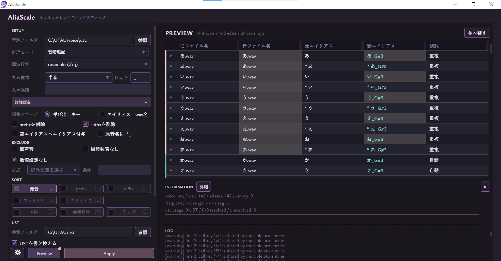

# AliaScale

## インストール
ここの[リリースページ](https://github.com/Mewir0/AliaScale/releases/latest)からzipを解凍し、フォルダ中のAliaScale.exeを実行してください。

## 概要

oto.ini内に記載された音素名について、ustなど各関連ファイル間の整合性を保ったまま色々な方法で整理できる音素名特化型のoto.iniエディタソフト/UTAUプラグインです。

UTAU上で歌詞として入力する音の名前に音階を付けたり番号を振ったり、oto.ini内を好きに並べ替えしたりできます。
ustや周波数表も一緒に更新するので音素名を変更しても過去のustをそのまま歌わせることができます。

### できること
- 原音ファイル名やエイリアスを編集する(自動・手動)
  - 音階名を付ける(例：あ.wav→あ_G3.wav)
  - 通し番号を振る
  - 文字置換
- oto.iniの各行を並べ替える
  - 発音順
  - ファイル名順
  - ustでの使用頻度順
  -  音高順
- エイリアスの重複を検知し警告する
- 音源が使用されているustをフォルダ内から検索(再帰)して一覧表示する
- 書き換えたエイリアスやファイル名が ustの歌詞で使われていたら、それも新しい歌詞に更新する
- 原音ファイル名を変えたら周波数表や各エンジンの使用するファイルも一緒に更新する
- 音源やoto.ini各行の統計情報や発音ごとのエイリアス数を確認する
### できないこと
- oto.iniの数値部分を書き換える
- oto.iniに新しい行を追加したり、いらない行を削除したりする
- (今後対応予定)OpenUTAU対応のustxの書き換え

### UTAU経由で起動する
zipを解凍して出てきたフォルダをutau.exe(本体)と同じ場所にあるpluginsフォルダへ入れることで、UTAUのプラグイン一覧から呼び出せるようになります(一覧に表示されないときはリロードを押してみてください)。
編集中のustで音符を選択したのちにUTAUから起動すると、選択範囲の歌詞を直接編集することができます。編集したい範囲を選択してプラグイン一覧からAliaScaleを起動してください。

スタンドアロンでも問題なく動作しますが、UTAU経由の方がセキュリティソフトに引っかからないがちなのでおすすめです。

## 使い方
1. 音源フォルダを選択(またはパスを入力)します。
   UTAUから開いた場合は現在のustの音源が予め選択されています(変更もできます)。

1. 処理モードとオプションを選択します。
   SETUP、REWRITE、EXCLUDEの各項目では、自動編集の有無や除外設定を行うことができます。
   SORTはoto.iniの各行の並べ替え、USTは対象の音源が使用されている.ust/.ustxを検索します。

1. PREVIEWボタンを押すと右側にwav名やエイリアスの新旧比較表が作成されます。表内の新しいwav名やエイリアスは手動で編集することも可能です。設定を変更して再度PREVIEWを実行する場合、手動編集はリセットされるのでご注意ください。
プレビューなのでこの段階で各ファイルに編集は適用**されません**。

1. いい感じになったらAPPLYボタンを押してください。編集内容がoto.iniやその他ファイルに反映されます。

詳しい使い方は[使い方ガイド](./docs/Manual.md)をご参照ください。

## 諸注意
本ソフトウェアはoto.iniや原音ファイルを直接書き換えます。
書き換え実行の直前に、書き換え対象のバックアップを本プラグインと同階層のbackup/内に作成します。規定では音源フォルダを丸ごとコピーしますが、ディスク容量が気になる方は設定ウィンドウからバックアップ設定を変更してください。

### 実行時ファイルの保存先

設定ファイル、プリセットなどは `AliaScale.exe` と同じ階層の `settings/` に保存されます。
バックアップは同じ階層の `backup/`、デバッグ用ログは `logs/` に保存されます。

## 免責事項
本ソフトウェアを利用（コンピュータへのインストール及びソフトウェアの使用）することによるいかなる損害も、作者は責任を負いません。

This project is licensed under the MIT License, see the LICENSE file for details

## 配布元・連絡先
アップデートはリリースページをご確認ください。
ご意見、ご要望、不具合報告などございましたら、下記アカウントまでご連絡いただけると幸いです。

> 作者: 迷路  
Twitter(現X): @MeisIllust ([リンク](https://x.com/MeisIllust)) 
[匿名箱](<https://t.co/JVc6pCNlCF> )

